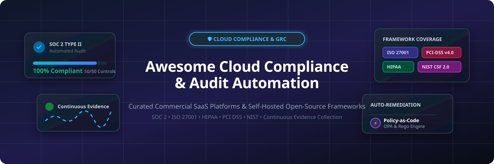

# Awesome-Cloud-Compliance-Audit-Automation

# Awesome-Cloud-Compliance-Audit-Automation 📋 ✅



  





  
  
  
  
  
  



---

## 🌟 Top Cloud Compliance & Audit Automation Ecosystem

**Curated List of Commercial GRC Platforms & Open-Source Compliance Frameworks**  
*Focused on SOC 2 Automation, ISO 27001 Readiness, Evidence Collection, Continuous Monitoring & Self-Hosted GRC*

**Last updated: October 2026** 📅

---

### 📌 Overview & SEO Summary
Welcome to the ultimate curated directory of **cloud compliance automation platforms**, **open-source GRC frameworks**, and **audit readiness tools**. Whether you are looking for enterprise-grade commercial solutions (such as *Vanta*, *Drata*, and *Secureframe*), or self-hostable open-source alternatives (like *CISO Assistant*, *Probo*, and *ComplianceOS*), this list covers category leaders, control reuse engines, and privacy-respecting compliance automation.

---

## 📑 Table of Contents
- [🏢 SaaS & Commercial Platforms](#-saas--commercial-platforms)
- [🔓 Open-Source GitHub Projects](#-open-source-github-projects)
- [🛠️ How to Contribute](#%EF%B8%8F-how-to-contribute)
- [📊 Star History](#-star-history)
- [🤝 Support & Sponsorship](#-support--sponsorship)
- [⚠️ Disclaimer](#%EF%B8%8F-disclaimer)

---

## 🏢 SaaS / Commercial Platforms

The compliance automation market has consolidated around a handful of platforms that charge **$4K–$15K per year for a single framework**, with multi-framework and enterprise tiers scaling significantly higher . **Drata** and **Vanta** lead in integration breadth and auditor networks, while **Secureframe** aggressively undercuts on price with strong remediation guidance . **Scrut** differentiates through **Unified Control Framework** allowing evidence reuse across **60+ frameworks** . **Sprinto** offers the lowest entry price and fastest setup for single-framework certifications . **Thoropass** bundles auditors directly into the platform, reducing the coordination burden for teams without dedicated compliance staff . **AWS Audit Manager** provides a **free tier** for AWS-native compliance assessments, automating evidence collection from AWS services .

| SaaS / Commercial Platform | Company / Owner | Valuation / Market Cap | Standard Edition Starting Price | Free Tier / Free Trial Limits | Description |
| :--- | :--- | :--- | :--- | :--- | :--- |
| **[AWS Audit Manager](https://aws.amazon.com/audit-manager/)** ☁️ | Amazon | ~$2.0 Trillion | **Free tier available**; pay for underlying AWS services | **Free tier: 3 assessments, 3 months of evidence** | **AWS-native compliance automation** — Continuously collects evidence from AWS services for audits. Prebuilt frameworks: SOC 2, PCI DSS, ISO 27001, HIPAA, GDPR, NIST. Custom controls supported. Evidence stored in S3 . |
| **[Vanta](https://www.vanta.com/)** 🟢 | Vanta | Private | **$4K–$15K+/year** for single framework | **No permanent free tier**; trial available | **Compliance automation leader** — 35+ frameworks supported. **Broadest integration catalog and auditor network** . Automated evidence collection, continuous monitoring, and policy templates. |
| **[Drata](https://drata.com/)** 🔵 | Drata | Private | **$10K–$25K onboarding fee** + annual subscription | **No free tier**; demo available | **Continuous compliance automation** — 20+ frameworks. **Strong for teams with dedicated security/GRC lead** . Automated evidence, risk management, and vendor monitoring. |
| **[Secureframe](https://secureframe.com/)** 🟠 | Secureframe | Private | **$7.5K/year** (entry); **~$7.5K per additional framework**  | **No free tier**; trial available | **Price-aggressive compliance platform** — **Strongest remediation guidance** — tells you the specific next step when controls fail . Smaller integration catalog than Vanta. |
| **[Scrut Automation](https://www.scrut.io/)** 🟣 | Scrut | Private | **$10K–$15K/year** per framework  | **No free tier**; demo available | **Multi-framework specialist** — **Unified Control Framework** reuses evidence across **60+ frameworks**. AI "Teammates" for execution and questionnaire responses . |
| **[Sprinto](https://sprinto.com/)** 🟡 | Sprinto | Private | **Lowest entry price** among automation tools  | **No free tier**; demo available | **Fastest setup for first certification** — Best for startups getting SOC 2 or ISO 27001 for the first time. Single-framework focus with straightforward workflow . |
| **[Thoropass](https://thoropass.com/)** 🔴 | Thoropass | Private | **Bundled auditor pricing**  | **No free tier**; demo available | **Audit-bundled compliance** — **Auditors included in the platform**, reducing coordination burden. Best for teams **without dedicated compliance personnel** . |
| **[Hyperproof](https://hyperproof.io/)** ⚙️ | Hyperproof | Private | Custom enterprise pricing | **Free trial available** | **GRC platform** — Risk management, compliance operations, and audit management. **Rewards depth for teams with dedicated GRC lead** . |
| **[Anecdotes](https://www.anecdotes.ai/)** 📊 | Anecdotes | Private | Custom enterprise pricing | **Demo available** | **Compliance operations automation** — Continuous controls monitoring, evidence collection, and risk assessment across cloud environments. |
| **[AuditBoard](https://www.auditboard.com/)** 🏢 | AuditBoard | ~$3 Billion | Custom enterprise pricing | **Demo available** | **Connected risk platform** — SOX compliance, internal audit, risk management, and information security. **Enterprise-focused** for large organizations. |

---

## 🔓 Open-Source GitHub Projects

*Sorted by GitHub_Stars_Count (Descending)* 🌟

- **[CISO Assistant](https://github.com/intuitem/ciso-assistant-community)**   
  **One-stop-shop GRC platform for cybersecurity management**, AGPL-3.0-or-later licensed. **Supports 130+ global frameworks with automatic control mapping**, including ISO 27001, NIST CSF, SOC 2, CIS, PCI DSS, NIS2, DORA, GDPR, HIPAA, CMMC, and more . **Vitality score: 96%** on the EU OSS Catalogue . **Features**: risk management, compliance management, GDPR management, risk quantification, vulnerabilities, MCP, and API . **Controls are reusable objects** — structure work consistently across frameworks . **Docker-based self-hosting** with role-based access controls. All data remains in your environment . **The most comprehensive open-source GRC platform available** . 🏛️

- **[Probo](https://github.com/getprobo/probo)**   
  **Open-source compliance automation with embedded compliance officers**, MIT licensed. **1,350 stars, active development** (last commit 2 hours ago) . **Compliance officers work inside Probo** on policies, controls, evidence, reviews, assessments, and auditor coordination . **Self-hosted** — compliance data stays under your control, critical for regulated markets . **Technical surface**: web console, CLI, MCP API, and GraphQL . **Trade-off**: self-hosting requires engineering time. **Best for**: teams that want open-source control without running the whole process alone . 🏛️

- **[OpenSCAP](https://github.com/OpenSCAP/openscap)**   
  **Security compliance and vulnerability scanning**, LGPL-2.1 licensed. **Implements NIST's SCAP standard** — XCCDF profiles, OVAL definitions, and CPE matching . **Audits systems against DISA STIG, HIPAA, PCI-DSS, and CIS benchmarks** . **Oracle Linux integration** with `scap-security-guide` package providing pre-built profiles . **Remediation steps** for non-compliant configurations. **The foundational open-source compliance scanning engine** for operating systems. 🎯

- **[StrongDM Comply](https://github.com/strongdm/comply)**   
  **Compliance automation framework focused on SOC 2**, MIT licensed. **1,303 stars, 246 forks** . **Go-based** framework for building compliance documentation and evidence collection workflows. **Git-based policy management** — version-control your compliance artifacts. 🛠️

- **[gapps](https://github.com/bmarsh9/gapps)**   
  **Security compliance platform for SOC 2, CMMC, ASVS, ISO 27001, HIPAA, NIST CSF, NIST 800-53, CIS 18, and PCI DSS**, open-source. **Self-hosted compliance tracking** with framework mappings and control status. **Darkbanner** project for teams wanting a lightweight web-based compliance dashboard . 📊

- **[Complisight](https://github.com/loftwah/complisight)**   
  **SOC 2 compliance CLI for developers**, open-source. **Go-based with Cobra framework** — automated evaluation of SOC 2 compliance across **Security, Availability, Processing Integrity, Confidentiality, and Privacy** . **Command-line first** — integrate into CI/CD pipelines and developer workflows. 🔧

- **[ComplianceOS](https://pypi.org/project/autoai-complianceos/)**   
  **Real compliance automation: scans, remediates, and generates audit-ready evidence**, Apache-2.0 licensed . **Key differentiator: ComplianceOS fixes compliance issues** — Vanta and Drata collect evidence; ComplianceOS auto-fixes . **Frameworks**: SOC 2 Type II (50+ controls, 20+ auto-fixable), ISO 27001 (25+ controls), GDPR, HIPAA, PCI DSS v4.0 . **Scans**: code (secrets, SQL injection, XSS), infrastructure (public buckets, encryption, IAM), configuration (policies, risk registers), and API (GDPR DSAR endpoints, security headers) . **MCP server included** — works with Claude Code and Cursor without signup or API keys. **No data leaves your machine** . 🚀

- **[Policy Pipeline](https://github.com/gjyoung1974/policy-pipeline)**   
  **SDLC around compliance documentation**, open-source. **Renders policy-as-code to human-friendly formats** — place a pipeline around your compliance docs . **GitHub-native** — manage SOC 2 compliance using nothing but GitHub. 📝

- **[Medplum](https://github.com/medplum/medplum)**   
  **Healthcare platform for building compliant applications**, Apache-2.0 licensed. **Purpose-built for HIPAA compliance** — quickly develop high-quality compliant healthcare applications. **FHIR-native** with audit logging and access controls . 🏥

- **[Prowler](https://github.com/prowler-cloud/prowler)**   
  **Comprehensive cloud security assessment tool**, Apache-2.0 licensed. **553 checks for AWS, 138 for Azure, 77 for GCP, 83 for Kubernetes** covering CIS, NIST 800, NIST CSF, PCI-DSS, GDPR, HIPAA, SOC2 . **Direct mapping to compliance frameworks** — generate audit reports in hours for SOC 2, PCI DSS, and NIS2 . **Prowler Cloud** for multi-account dashboards. **The most widely used open-source cloud compliance scanner** . 🛡️

- **[OPA (Open Policy Agent)](https://github.com/open-policy-agent/opa)**   
  **Policy-as-code engine for compliance enforcement**, Apache-2.0 licensed. **Unified policy framework for reliability and security compliance** . **Rego policies** enforce declarative rules across the entire software lifecycle — from developer workstations to CI/CD pipelines and production runtime . **Single source of truth** for compliance — reuse same policies for build-time validation, admission control (Gatekeeper), and runtime auditing . **Multiple enforcement modes**: deny, mutate, allow-with-notification, and monitor-and-alert . 🎛️

---

## 🛠️ How to Contribute

Contributions are welcome! Follow these steps to submit new compliance automation platforms or open-source GRC software:

1. 🍴 **Fork** the repository.
2. 📝 **Add/edit** entries in `README.md` maintaining table/list structure and formatting.
3. 🔗 Include project title, official website/GitHub link, exact Stars_Count, license, and brief description.
4. 🚀 Submit a **Pull Request** with a descriptive summary of your changes.

---

## 📊 Star History



---

## 🤝 Support & Sponsorship

If you find this cloud compliance automation repository useful, please consider supporting the project:

- ⭐ **Star** this repository to increase visibility!
- 🔀 **Fork** and share with fellow compliance officers, security engineers, and open-source advocates.
- ☕ **Sponsor & Buy Me a Coffee**: Support ongoing open-source curation via the [GitHub Sponsor Dashboard](https://github.com/sponsors/ishandutta2007).

---

## ⚠️ Disclaimer

- This is a **community-curated** list — not exhaustive and not an endorsement. ℹ️
- **Open-source compliance tools are not free** — CISO Assistant and Probo are excellent with zero license cost, but their real cost is **a person**. Someone runs upgrades, maps frameworks, wires SSO, and answers questions when an auditor asks for evidence. If your compliance team is one person with a full workload, a paid tool with support is cheaper in practice .
- **Vanta and Drata charge onboarding fees** — Drata’s onboarding is **$10K–$25K** on top of annual subscription . **Renewal increases are common** — negotiate aggressively using competing quotes.
- **Secureframe has a smaller integration catalog than Vanta** — if you use a niche tool in your stack, you may end up collecting some evidence manually. **Check your integrations list before signing** .
- **Scrut’s breadth means a steeper learning curve** than single-framework tools. **If you only ever need one framework, you’re paying for range you won’t use** .
- Open-source solutions (CISO Assistant, Probo, ComplianceOS, OpenSCAP) provide self-hosted ownership and transparency, but enterprise-grade SLA guarantees, auditor networks, and managed infrastructure remain primarily commercial offerings. **Always validate compliance mappings against your specific audit requirements** before relying on any tool. 📋

---



  <b>Made with ❤️ for compliance officers, security engineers, and open-source GRC advocates.</b>

